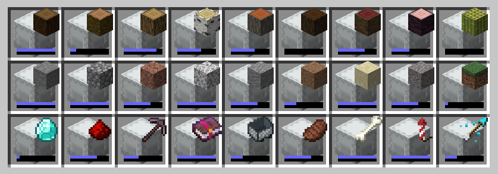

# Simple Shulker Preview

Simple Shulker Preview is a small fabric mod that displays an icon indicating the contents of a shulker. This icon appears on top of the shulker icon in inventory slots.

For other download pages, please see [CurseForge](https://www.curseforge.com/minecraft/mc-mods/simple-shulker-preview) or [Modrinth](https://modrinth.com/mod/simple-shulker-preview).

## Dependencies
This mod requires [ModMenu](https://www.curseforge.com/minecraft/mc-mods/modmenu) to adjust the configs. The [Cloth Config API](https://www.curseforge.com/minecraft/mc-mods/cloth-config) mod is embedded - you don't need to download it yourself. 

## Configs
I won't go through all the configs, since they've increased over time. A brief overview is as follows:

| **Option**          | **Description**                                                                      |
|---------------------|--------------------------------------------------------------------------------------|
| `Display Item`      | Decides which item in the shulker should be displayed based on position or quantity. |
| `Icon Positions`    | Modify the x and y offsets of the icon, as well as scale.                            |
| `Capacity Bar`      | Display a capacity bar, indicating how full the shulker box is                       |
| `Bar Position`      | Set the position, size, and _direction_ the capacity bar is drawn.                   |
| `Stack Limits`      | Set minimum limits for the number of items required to display an icon               |
| `Enable ...`        | Option to enable additional features, such as bundles or recursive shulker support   |
| `Disable Mod`       | Disables the mod so that overlay icons are not displayed.                            |

## Mod Compatibility
The following features have been tested for compatibility and work with this mod. Mods with these functionalities should also work, however I can't promise anything.
- Bundles (can show the icon on bundles too)
- Custom heads (treats them as individual items rather than a single player head)
- Recursive shulkers (shulkers stored in shulkers)
- Stacked shulkers (full / empty shulkers that are stacked together)
- Variable shulkers sizes

The following mods were used in testing:
| **Mod** | **Feature** |
|---------|-------------|
| Carpet Essential Addons | Stacked shulkers |
| Reinforced Shulker Boxes Mod | Variable sized shulkers |
| MicroCutting | Custom Heads |
| HeadIndex | Custom Heads |
| JustMobHeads | Custom Heads |
| MoreMobHeads | Custom Heads |
| Player Head Drops | Custom Heads |
| All Mob Heads | Custom Heads |
| Forgotten... Need a new mod. | Recursive shulkers |

## Contributing
Contributions and suggestions are always welcome! Please limit all issues to only one feature at a time - feel free to open multiple at once if you have many ideas. Similarly, please limit pull requests to a single feature at a time and try to follow the existing code style.
