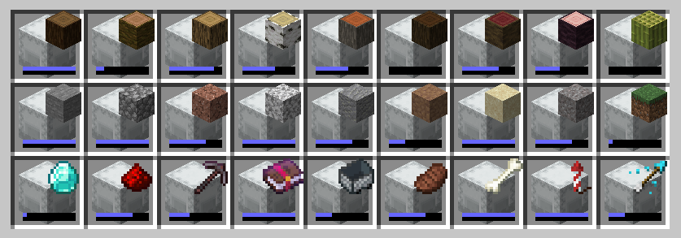

# Simple Shulker Preview

Simple Shulker Preview is a small fabric mod that displays an icon indicating the contents of a shulker. This icon appears on top of the shulker icon in inventory slots.

For other download pages, please see [CurseForge](https://www.curseforge.com/minecraft/mc-mods/simple-shulker-preview) or [Modrinth](https://modrinth.com/mod/simple-shulker-preview).

## Dependencies
This mod requires [YetAnotherConfigLib (YACL) v3](https://modrinth.com/mod/yacl) to manage configurations, and [ModMenu](https://www.curseforge.com/minecraft/mc-mods/modmenu) to access the config screen in-game.

## Configs
The configuration screen now features a **real-time live preview** on the right side. Adjusting position sliders, toggling displays, or selecting sorting algorithms will immediately show the results on a dummy item in the config menu itself!

A brief overview of the main settings:

| **Option**                                | **Description**                                                                           |
|-------------------------------------------|-------------------------------------------------------------------------------------------|
| `Preview Selection Logic`                 | Decides which item in the container should be displayed based on position or quantity.    |
| `Icon Based on Container Name`            | Provides options to display an icon based on custom-named containers.                      |
| `Preview Icon Position & Size`            | Adjust the x and y offsets of the icon, as well as scale (general, stacked, or bundle).   |
| `Show Capacity Bar`                       | Toggle the capacity bar, indicating how full the container is.                           |
| `Capacity Bar Options`                    | Set the position, size, orientation, and shadow of the capacity bar.                      |
| `Thresholds to Show Preview Icon`         | Set minimum limits for the number of items/slots required to display an icon.             |
| `Preview Icons on Bundles / Modded`       | Toggle compatibility modes for Bundles, other container items, etc.                       |
| `Enable Mod`                              | Globally enables or disables all preview icons and capacity bars.                         |

When using custom named shulkers, you need to name it using the same conventions required for spawning in items. For example, naming a shulker `minecraft:grass_block` (or simply `grass_block`) will display a grass block. If an invalid name has been given, it will continue to follow the 'Preview Selection Logic' configuration (unless 'Icon Based on Container Name' has been set to 'Hide Icons Unless Named', of course).

## Contributing
Contributions and suggestions are always welcome! Please limit all issues to only one feature at a time - feel free to open multiple at once if you have many ideas. Similarly, please limit pull requests to a single feature at a time and try to follow the existing code style.

To further discuss or get notifications of new updates, check out my [Discord](https://discord.gg/gyTa5v7kKk). If you like what I do, consider supporting me on Ko-Fi! 
